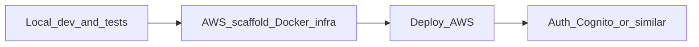
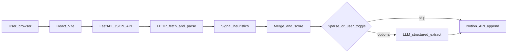

# Custom CRM: Web scrape to Notion (signals-style)

## Context

Your workspace at `[/Users/Katie/Desktop/CRM_Python_Foolery/CRM](/Users/Katie/Desktop/CRM_Python_Foolery/CRM)` is empty, so this is a **new project**. You chose a **local web UI** and **hybrid extraction** (fast heuristics + optional LLM when useful).

**Delivery phases** (ordered):

1. **Local build and test** — Feature-complete CRM flow on your machine; automated tests for the API and critical extraction logic.
2. **AWS-oriented scaffolding** — Container and documented deploy target so moving to AWS is incremental, not a rewrite.
3. **AWS go-live** — Run the container (or split static/API) in your chosen AWS service; secrets in Parameter Store / Secrets Manager.
4. **Authentication** — Add **after** AWS go-live: lock down the API and UI so only signed-in users can scrape and push to Notion.




**MVP security**: Local and first AWS deploy may run **without** end-user auth (acceptable for a private integration if network-restricted); **public internet** on AWS should move quickly to phase 4.

## Product shape




**Frontend/backend split**: React owns the form, preview table, and loading/error UI; FastAPI exposes only JSON endpoints (no server-rendered HTML).

- **Single-page flow**: User pastes a URL (and optional company label), clicks **Run**, sees a preview of extracted signals, confirms **Send to Notion** (or auto-send with a setting).
- **Signals** (HubSpot-adjacent, practical for outbound research): e.g. **company name**, **one-liner / description**, **industry guess** (from keywords or JSON-LD), **HQ location** (if found), **contact hints** (emails, phone patterns), **social URLs** (LinkedIn, X, etc.), **funding / employee count** only when present in visible text or structured data (avoid hallucination—LLM should cite "unknown" when absent), **source URL**, **scraped at**, **confidence / extraction method** (heuristic vs LLM).

## Tech stack (lean)


| Layer           | Choice                                                                                                                                                                        |
| --------------- | ----------------------------------------------------------------------------------------------------------------------------------------------------------------------------- |
| Web             | **React** (Vite + TypeScript) SPA for UI; **FastAPI** as JSON API only                                                                                                        |
| Dev UX          | Vite dev server with **proxy** to FastAPI (e.g. `/api` → `localhost:8000`) to avoid CORS friction; optional `CORSMiddleware` as fallback                                      |
| Prod UX         | `vite build` output served by FastAPI from `static/` (or `frontend/dist`) with SPA fallback to `index.html`                                                                   |
| Fetch/parse     | **httpx** (async) + **BeautifulSoup4**; **selectolax** optional later for speed                                                                                               |
| JS-heavy sites  | **Phase 2**: optional **Playwright** path behind a checkbox ("Render JavaScript")—heavier install; not required for MVP                                                       |
| Notion          | Official **notion-client** Python package (Notion API current stable)                                                                                                         |
| Config          | **pydantic-settings** + `.env` for secrets                                                                                                                                    |
| LLM (optional)  | **OpenAI** or **Anthropic** SDK behind an interface; only called when heuristics are low-coverage **or** user checks "Use LLM"                                                |
| Local testing   | **pytest** + FastAPI `TestClient` / httpx async tests for `/api/`*; optional **Vitest** for React components; aim for CI-friendly `pytest` / `npm test`                       |
| AWS (later)     | **Docker** image running uvicorn + static assets (single service is simplest); deploy via **App Runner**, **ECS Fargate + ALB**, or **Elastic Beanstalk**—pick at deploy time |
| Secrets (AWS)   | **SSM Parameter Store** or **Secrets Manager** for `NOTION_`*, LLM keys—not committed `.env` in prod                                                                          |
| Auth (post-AWS) | **Amazon Cognito** (User Pool + hosted UI or custom React) pairs cleanly with AWS; alternatives (Auth0, Clerk) if you prefer—implement only after go-live                     |


## Local development and testing

- **Run**: Document two-process dev (Vite + uvicorn) or a single `make dev` / script; production-like check: `vite build` then FastAPI serves `frontend/dist` locally.
- **Backend tests**: `pytest` covering `/api/preview` and `/api/push` (mock Notion + mock fetch HTML fixtures) so scraping and Notion mapping do not regress.
- **Extraction tests**: Small HTML fixtures (with/without JSON-LD, meta tags) asserting stable `ScrapedSignals` + coverage score behavior.
- **Frontend tests** (optional for MVP): Smoke tests for form submit and error display.

## AWS deployment scaffolding (not full deploy until you are ready)

Purpose: avoid a late “port to Docker” surprise; you can still develop entirely locally for weeks.

- **Dockerfile**: Build React (`npm ci && npm run build`), copy `dist` into image, install Python deps, run **uvicorn** (single process serves API + static—matches current plan). `.dockerignore` excludes `node_modules`, `.venv`, local `.env`.
- `**infra/` or `deploy/`**: Short **README** only at first—document intended AWS shape (e.g. “App Runner: connect repo, set env vars, point to image”), optional placeholder for later **CDK** / **Terraform** if you want IaC later.
- **Environment**: Same env vars as local (`NOTION_`*, optional LLM keys) loaded from AWS secrets in production; no secrets in the image.

Full AWS provisioning (VPC, DNS, HTTPS) is intentionally **out of band** until you choose a service and account layout; scaffolding keeps the app **deploy-shaped**.

## Authentication (after AWS is live)

- **Scope**: Protect `/api/preview` and `/api/push` (and optionally static routes) so anonymous internet users cannot use your Notion integration or burn LLM quota.
- **Typical pattern**: **Cognito User Pool** → React uses Amplify / OIDC client → API sends **Bearer JWT** → FastAPI dependency validates JWT (issuer, audience, signature) before running scrape/Notion logic.
- **Not in initial build**: No auth middleware in the first local MVP unless you explicitly want it early—adds complexity before the core CRM works.

## Notion setup (your side)

1. Create a **Notion integration** at [notion.so/my-integrations](https://www.notion.so/my-integrations), copy the **Internal Integration Secret**.
2. Create a **Notion database** (full page DB) with properties that match what the app will write—either:
  - **Fixed schema** in code (simplest): app documents required property names and types (Title, URL, Rich text, Date, Select, etc.), or
  - **Config mapping**: a small YAML/JSON in the repo mapping our field names to your Notion property IDs (more flexible, slightly more setup).

The plan assumes **one database ID** in `.env` (`NOTION_DATABASE_ID`) and property names aligned with the app (documented in README).

## Heuristic extraction (always-on)

- **HTML meta**: `og:title`, `og:description`, `description`, `twitter:`*.
- **Structured data**: JSON-LD (`Organization`, `WebSite`, `LocalBusiness`) when present.
- **Page structure**: first `h1`, key `h2` blocks, footer/header link patterns.
- **Signals from links**: `mailto:`, `tel:`, obvious social domains in `href`.
- **Light robots awareness**: fetch `/robots.txt` for the host and **refuse** disallowed paths (or warn in UI)—reduces legal/ethical risk for a research tool.

Output: a **Pydantic model** `ScrapedSignals` with optional fields + a **coverage score** (how many high-value fields were filled without guessing).

## Optional LLM path (hybrid)

- **Trigger**: `coverage_score < threshold` **or** user enables "Use LLM".
- **Input**: trimmed visible text (e.g. main content heuristic + meta), **not** full raw HTML dump (token/cost control).
- **Output**: same `ScrapedSignals` schema; enforce **JSON** via API; post-validate with Pydantic; merge with heuristics (heuristics win on direct conflicts for factual fields like email).

## API surface (local; unchanged when containerized)

- `GET /api/health` (optional) — liveness for the React app and load balancers on AWS.
- `POST /api/preview` — scrape + extract, return JSON for preview (no Notion write).
- `POST /api/push` — same pipeline + **append** Notion page row (or update if you later add dedupe by domain).

**Note**: Prefix routes with `/api` so Vite proxy rules stay simple (`/api` → backend). React `fetch('/api/preview', …)` works in dev and prod when the built assets are served by the same origin.

**Post-auth** (phase 4): Same routes; add **Depends(verify_jwt)** (or equivalent) on mutating/expensive handlers.

## Project layout (proposed)

```
CRM/
  frontend/
    package.json
    vite.config.ts       # proxy /api → FastAPI
    src/
      App.tsx
      main.tsx
      api.ts             # typed fetch helpers
      components/        # form, preview, signals display
  app/                   # or backend/ — Python package
    main.py              # FastAPI app, CORS, static mount + SPA fallback in prod
    scraper.py           # fetch, robots check, parse
    extract_heuristic.py
    extract_llm.py       # optional
    notion_push.py       # create page with properties
    models.py            # Pydantic schemas
    settings.py
  .env.example
  requirements.txt
  package-lock.json / pnpm-lock (in frontend/)
  Dockerfile
  .dockerignore
  infra/
    README.md            # AWS target sketch, env vars, deploy checklist
  README.md              # Notion DB schema, local dev, tests, Docker build, future AWS + auth
```

## Risks and constraints (explicit)

- **Terms of service / legality**: Some sites forbid scraping; the tool should default to **polite** behavior (timeouts, single-page scope, robots check). No bypass of logins/paywalls in scope.
- **Accuracy**: Heuristics are best-effort; LLM reduces gaps but can still err—preview before Notion is recommended.
- **MVP scope**: One URL per run, one row per run; no CRM-wide deduplication unless you want it as a follow-up.

## Implementation order

1. **Scaffold** Vite + React (TS) shell (URL form, preview panel, loading states) + FastAPI `/api/preview` returning mock JSON until extraction exists; wire Vite proxy to FastAPI.
2. **Scraper + heuristics** → real `ScrapedSignals` + coverage score; connect React preview to live JSON.
3. **Notion append** with `.env` and documented DB properties; React **Send to Notion** calls `/api/push`.
4. **LLM merge** behind flag + threshold (checkbox in React + request body field).
5. **Polish**: shared types (optional **openapi-typescript** or hand-written TS types mirroring Pydantic), validation errors, production static mount + SPA fallback, clear errors for Notion 404 (integration not shared to DB).
6. **Local testing**: pytest suite for API + extraction fixtures; document `make test` / `pytest` / `npm test` in README.
7. **AWS scaffolding**: Dockerfile + `.dockerignore` + `infra/README.md` (deploy options, env var list); verify `docker build` and container runs locally.
8. **AWS go-live** (your milestone): push image, configure secrets, HTTPS, smoke-test `/api/health` and full flow.
9. **Authentication**: Cognito (or chosen IdP) + FastAPI JWT validation + React login/logout; restrict `/api/`* to authenticated users.

## What you will need to provide during setup

- Notion integration secret and database ID; **share the database** with the integration (Notion UI: database → `...` → Connections).
- For AWS later: AWS account, preferred service (App Runner vs ECS vs other), and for auth phase: Cognito pool or chosen provider details.

Implementation follows this plan once you ask to execute it.